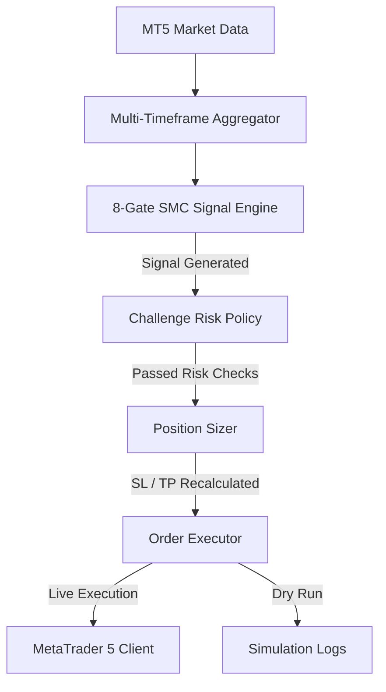

# 🤖 SMC Trading Bot (v5.0.0)

An advanced, production-grade automated trading system utilizing **Smart Money Concepts (SMC)** for MetaTrader 5 (MT5). The system is built for safety and strict risk compliance, specifically optimized to pass Prop Firm evaluation challenges (such as the **Atlas Funded $5K Step 1 Challenge**) while supporting dynamic, parallel multi-symbol execution (Gold, Bitcoin, and Forex).

---

## 📐 System Architecture

The trading bot operates as a sequential pipeline, channeling raw market data through an 8-gate verification process before executing orders:



---

## 🌟 Key Features

### 1. 🔬 Canonical 8-Gate SMC Signal Engine
Replaced legacy heuristic strategies with a unified sequential analysis engine. For a trade signal to be generated, it must pass all 8 gates:
- **Gate 0 (MT5 Connection):** Verifies active and stable connection to the MT5 terminal.
- **Gate 1 (Market Data Fetch):** Ensures sufficient and fresh bar data across all timeframes.
- **Gate 2 (Liquidity Sweep):** Confirms a recent sweep of high-timeframe (HTF) external liquidity.
- **Gate 3 (CHoCH/MSS Body Close):** Verifies a structural shift (Change of Character) on the lower timeframe (LTF) via a candle body close.
- **Gate 4 (POI Validity):** Identifies valid HTF Points of Interest (Order Blocks/FVGs) with **inducement** criteria. Supports a **1.5 * ATR near-miss buffer** to align M15 POIs that are extremely close to the HTF POI.
- **Gate 5 (OB/FVG Confluence):** Validates concurrent order blocks and imbalances at the entry area.
- **Gate 6 (Dealing Range):** Confirms that buys occur in the **Discount** zone and sells occur in the **Premium** zone (Mean Threshold breach check).
- **Gate 7 (Killzone Check):** Restricts trading to high-liquidity session windows: London Killzone (02:00-05:00 NY), NY Killzone (07:00-12:00 NY), and Asian Killzone. Hard-blocks the 00:00-02:00 NY Dead Zone.
- **Gate 8 (Risk-to-Reward):** Rejects any trade where the projected Risk-to-Reward ratio is below **3.0x**.

### 2. 🛡️ Prop Firm Challenge Policy (Atlas Funded)
Implements strict drawdown rules required by the Atlas Funded challenge program:
- **Daily Drawdown Floor:** Recalculated at Midnight UTC as `max(previous_day_highest_balance, previous_day_highest_equity) * 0.95` (5% limit).
- **Overall Trailing Drawdown Floor:** Recalculated in real-time as `max(all_time_highest_balance, all_time_highest_equity) * 0.93` (7% overall limit).
- **Profit Target Halt:** Instantly locks in challenge passes and stops trading when account balance reaches **$5,200** (for $5K challenges) or **4% profit**.
- **Startup Guard rails:** Validates broker server details, starting balance, sizer limits, and sizer risk per trade (<= 1.0%) on boot. Rejects startup if configurations fail.

### 3. 🌐 Dynamic Multi-Symbol Support
- **Single-Configuration Symbol Switching:** Resolves active trading symbol via the `SYMBOL` environment variable. Suffixes (e.g. `.pro`, `.raw`, `.a`) are dynamically detected.
- **Position Sizing Integration:** Automatically fetches `trade_contract_size` from MT5 to dynamically adjust sizing (Gold contract = 100; Bitcoin contract = 1.0).
- **Segregated State Persistence:** Saves states to `logs/session_state_{symbol}.json` and decision audit logs to `logs/decisions/audit_{symbol}.jsonl` to allow safe, parallel running of multiple symbol instances.

### 4. 📰 Economic Calendar News Blackout
- **Free ForexFactory Weekly Feed:** Dynamically pulls high-impact events from the public weekly JSON feed. No premium API keys required.
- **Dynamic Base/Quote Filtering:** Parses base and quote currencies from the active symbol (e.g. extracts `EUR` and `USD` from `EURUSD`) and filters news events on both.
- **15-Minute Blackout Window:** Prevents trade entries 15 minutes before and after high-impact news releases.

### 5. ⚙️ Strategy & Stop Loss Refinements
- **Adaptive ATR Buffers:** Standard OB/FVG entries use a `0.3x ATR` buffer. Sweeps and aggressive entries use a `0.8x ATR` buffer to survive wicks.
- **Minimum Stop Loss cap:** Restricts minimum Gold SL size to **35 pips (3.5 points)** to survive broker spreads. Bypasses this cap on BTCUSD by utilizing a dynamic stops checker.
- **Dynamic Pip Divisors:** Correctly computes MT5 spreads using a **100-point divisor for Bitcoin** ($1.00 = 1 pip) and a **10-point divisor for Gold/Forex** ($0.10 = 1 pip), preventing false spread rejections on crypto.
- **H4 Structural TP:** Trend-following targets look for H4 Intermediate-Term Highs (ITH) for buy setups and Intermediate-Term Lows (ITL) for sell setups.
- **Weekend Crypto Bypass:** Automatically detects crypto symbols (`BTC`, `ETH`) and bypasses weekend market shutdown blocks for 24/7 trading.

---

## 📂 Project Structure

```text
c:/Python_Project/tradingbot/TradingBOt/
├── apps/
│   └── trader/
│       ├── main.py                     # Main trading bot loop & startup validation
│       └── vps_reporter.py             # Oracle Cloud integration & status pings
├── config/
│   ├── .env                            # Active environment credentials and variables
│   └── settings.py                     # Config parser
├── logs/                               # Session state & audit logs
│   ├── decisions/
│   │   └── audit_{symbol}.jsonl        # Sequence audit logs of every analysis cycle
│   └── session_state_{symbol}.json     # Persisted watermarks and drawdown peaks
├── src/
│   └── tradingbot/
│       ├── data/
│       │   └── timeframe_aggregator.py # Multi-timeframe bar data fetcher
│       ├── execution/
│       │   └── order_executor.py       # Spread checking and order placement
│       ├── infra/
│       │   ├── mt5/
│       │   │   └── client.py           # MT5 Connection layer
│       │   └── news/
│       │       └── news_filter.py      # ForexFactory news scheduler
│       ├── risk/
│       │   ├── challenge_policy.py     # Prop firm drawdown rules engine
│       │   └── position_sizing.py      # Lot sizer, ATR buffer, and ITH/ITL finder
│       └── strategy/
│           └── smc/
│               └── signal_engine.py    # 8-Gate SMC Signal Engine
└── tests/                              # Pytest test suite
```

---

## 🔧 Installation & Setup

### 1. Clone & Set Up Python Environment
Ensure Python 3.10+ is installed on your Windows machine.
```powershell
# Clone the repository
git clone https://github.com/rkbharti/TradingBOt.git
cd TradingBOt

# Create a virtual environment
python -m venv .venv
.venv\Scripts\activate

# Install dependencies
pip install -r requirements.txt
```

### 2. Configure MetaTrader 5
1. Install the desktop version of **MetaTrader 5**.
2. Log into your broker account (e.g., **Atlas Funded**).
3. In MT5, go to `Tools` -> `Options` -> `Expert Advisors` and check:
   - ✅ **Allow automated trading**
   - ✅ **Allow WebRequest for listed URLs**
   - ✅ **Allow DLL imports**
4. Keep the terminal running on your machine.

### 3. Create the Environment File
Create a `.env` file inside the `config/` directory:

```env
# --- MT5 CREDENTIALS ---
MT5_LOGIN=your_mt5_login_id
MT5_PASSWORD=your_mt5_password
MT5_SERVER=AtlasFunded-Server
MT5_PATH=C:/Program Files/Atlas Funded MT5 Terminal/terminal64.exe

# --- ACTIVE TRADING SYMBOL ---
SYMBOL=XAUUSD
DASH_SYMBOLS=XAUUSD

# --- PROP FIRM RISK CONTROLS ---
PROP_FIRM=AtlasFunded
ACCOUNT_SIZE=5000
ACCOUNT_CURRENCY=USD
PROFIT_TARGET_PCT=4.0
DAILY_DRAWDOWN_PCT=5.0
MAX_DRAWDOWN_PCT=7.0
TRADING_MODE=CHALLENGE
DAILY_RESET_TZ=UTC

# --- ADDITIONAL RISK CONTROLS ---
RISK_PER_TRADE_PCT=0.25
MAX_TRADES_PER_DAY=5
MAX_CONSECUTIVE_LOSSES=5
MIN_TRADE_GAP_MINUTES=5
MAX_LOT_SIZE=0.5
RESET_CONSECUTIVE_LOSSES_DAILY=True
```

---

## 🚀 Running the Bot

To start the bot, run the following command in your terminal:
```powershell
python apps/trader/main.py
```

### Diagnostic Output Example:
```text
=== Initializing XAUUSDTradingBot ===
✅ Account balance: $5,000.00
✅ OrderExecutor wired
📂 Restored session state from disk. Date: 2026-06-19
🔍 Verifying Challenge Configuration...
Connected to MT5 Login: 212119512, Server: AtlasFunded-Server
✅ Resolved symbol to: XAUUSD
Drawdown Floors:
  Daily Floor: $4,750.00 (Current Equity: $5,000.00)
  Overall Trailing Floor: $4,650.00
✅ Challenge Configuration Verified successfully.
✅ Initialization complete
🌐 Starting bot control server on port 5000...
🔬 Running diagnostics...

=================================================================
🔬  SMC SIGNAL ENGINE — LIVE DIAGNOSTICS
=================================================================
[GATE 0] MT5 Connection           -> ✅ PASS
[GATE 1] Market Data Fetch        -> ✅ PASS — 300 bars
[GATE 2] Session Check            -> ✅ PASS — London Killzone
[GATE 3] Multi-Timeframe Data     -> ✅ M5, M15, H4, D1 fresh
=================================================================
```

---

## 🧪 Running Tests
The bot includes a robust unit testing suite verifying strategy extensions, News filters, trailing floors, and drawdown policies. Run tests via pytest:
```powershell
pytest
```

---

## ⚠️ Disclaimer
This system is built for **DEMO ACCOUNTS** only. Algorithmic trading carries significant financial risk. Always test configurations in sandbox environments before considering live deployments.
