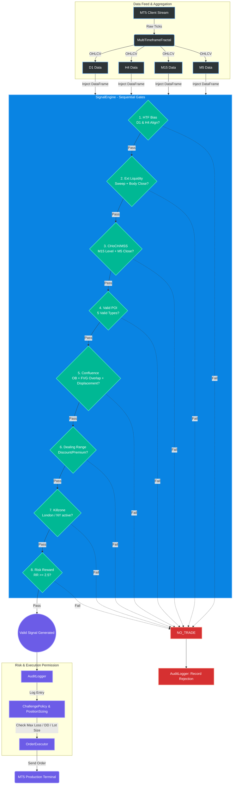

# Signal Pipeline Trace

```mermaid
flowchart TD
    %% Define styles
    classDef data fill:#2d3436,stroke:#74b9ff,stroke-width:2px,color:#fff
    classDef engine fill:#0984e3,stroke:#74b9ff,stroke-width:2px,color:#fff
    classDef gate fill:#00b894,stroke:#55efc4,stroke-width:2px,color:#fff
    classDef reject fill:#d63031,stroke:#fab1a0,stroke-width:2px,color:#fff
    classDef exec fill:#6c5ce7,stroke:#a29bfe,stroke-width:2px,color:#fff

    %% 1. Data Stage
    subgraph Data [Data Feed & Aggregation]
        MT5[MT5 Client Stream] -->|Raw Ticks| MTF(MultiTimeframeFractal)
        MTF -->|OHLCV| D1[D1 Data]
        MTF -->|OHLCV| H4[H4 Data]
        MTF -->|OHLCV| M15[M15 Data]
        MTF -->|OHLCV| M5[M5 Data]
    end

    %% 2. Structure Stage
    subgraph Engine [SignalEngine - Sequential Gates]
        Gate1{1. HTF Bias<br/>D1 & H4 Align?}
        Gate2{2. Ext Liquidity<br/>Sweep + Body Close?}
        Gate3{3. CHoCH/MSS<br/>M15 Level + M5 Close?}
        Gate4{4. Valid POI<br/>5 Valid Types?}
        Gate5{5. Confluence<br/>OB + FVG Overlap + Displacement?}
        Gate6{6. Dealing Range<br/>Discount/Premium?}
        Gate7{7. Killzone<br/>London / NY active?}
        Gate8{8. Risk Reward<br/>RR >= 2.5?}

        Gate1 -->|Pass| Gate2
        Gate2 -->|Pass| Gate3
        Gate3 -->|Pass| Gate4
        Gate4 -->|Pass| Gate5
        Gate5 -->|Pass| Gate6
        Gate6 -->|Pass| Gate7
        Gate7 -->|Pass| Gate8
    end

    %% Rejection Path
    Gate1 -. Fail .-> NoTrade[NO_TRADE]
    Gate2 -. Fail .-> NoTrade
    Gate3 -. Fail .-> NoTrade
    Gate4 -. Fail .-> NoTrade
    Gate5 -. Fail .-> NoTrade
    Gate6 -. Fail .-> NoTrade
    Gate7 -. Fail .-> NoTrade
    Gate8 -. Fail .-> NoTrade

    %% 3. Permission & Execution
    subgraph Permission [Risk & Execution Permission]
        Audit[AuditLogger]
        Risk[ChallengePolicy & PositionSizing]
        Exec[OrderExecutor]
    end

    %% Connections
    M5 & M15 & H4 & D1 -->|Inject DataFrame| Engine
    Gate8 -->|Pass| SignalValid((Valid Signal Generated))
    
    SignalValid --> Audit
    Audit -->|Log Entry| Risk
    Risk -->|Check Max Loss / DD / Lot Size| Exec
    Exec -->|Send Order| MT5API(MT5 Production Terminal)
    
    NoTrade --> AuditReject[AuditLogger: Record Rejection]

    %% Apply classes
    class MT5,MTF,D1,H4,M15,M5 data;
    class Engine engine;
    class Gate1,Gate2,Gate3,Gate4,Gate5,Gate6,Gate7,Gate8 gate;
    class NoTrade,AuditReject reject;
    class Audit,Risk,Exec,MT5API,SignalValid exec;
```
